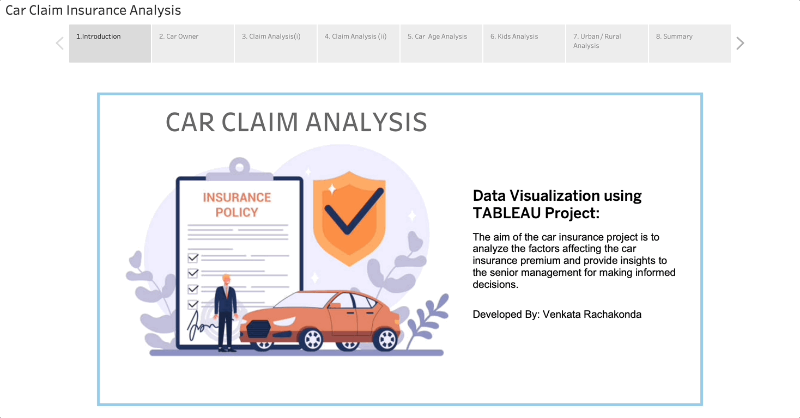
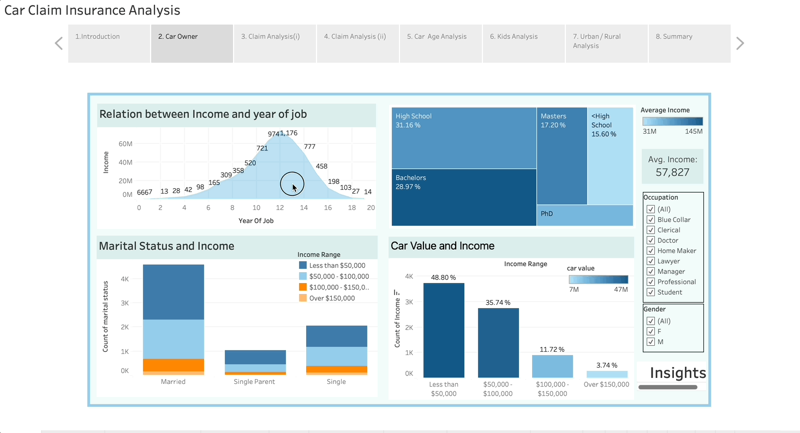
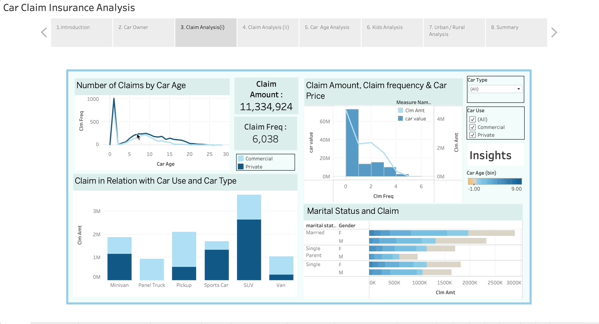
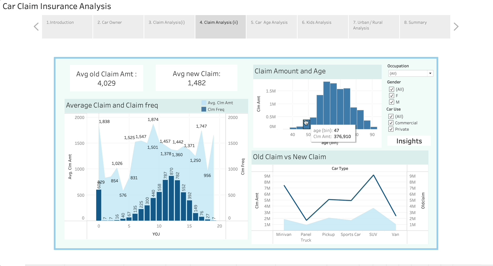
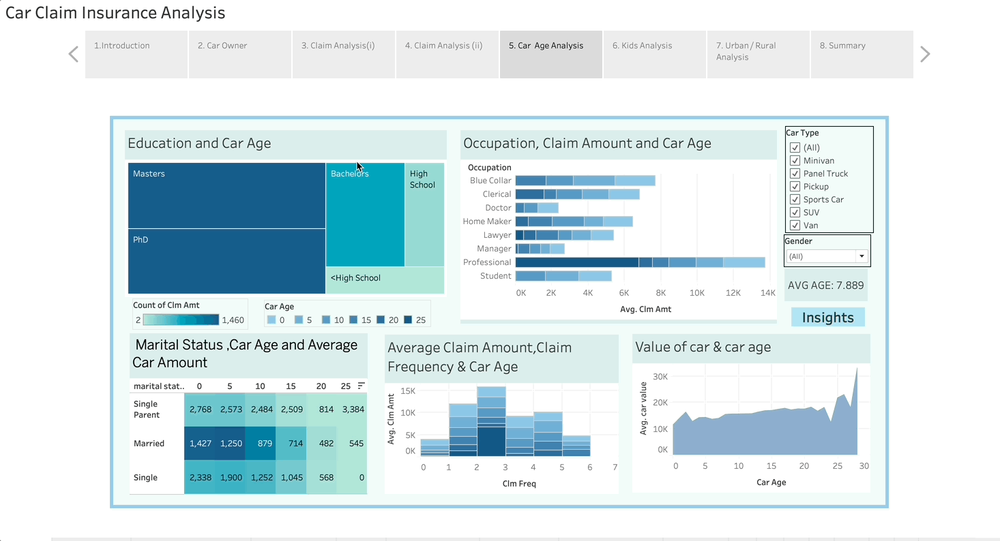
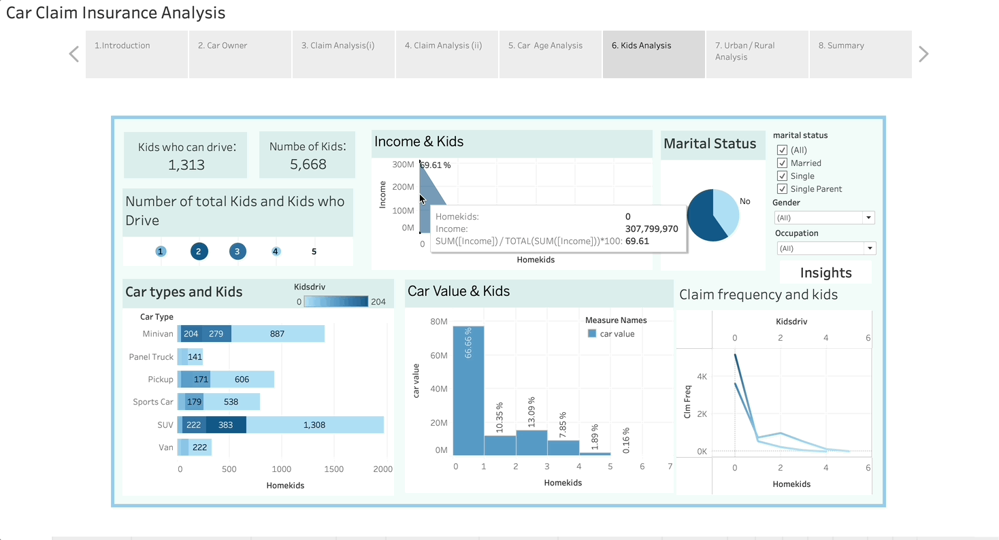
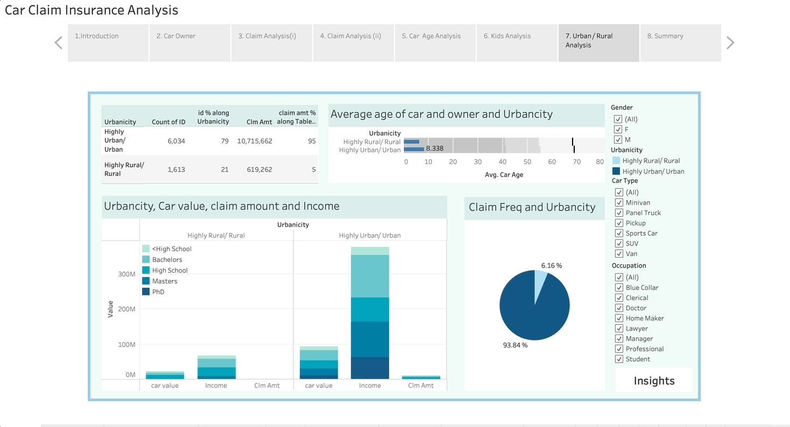
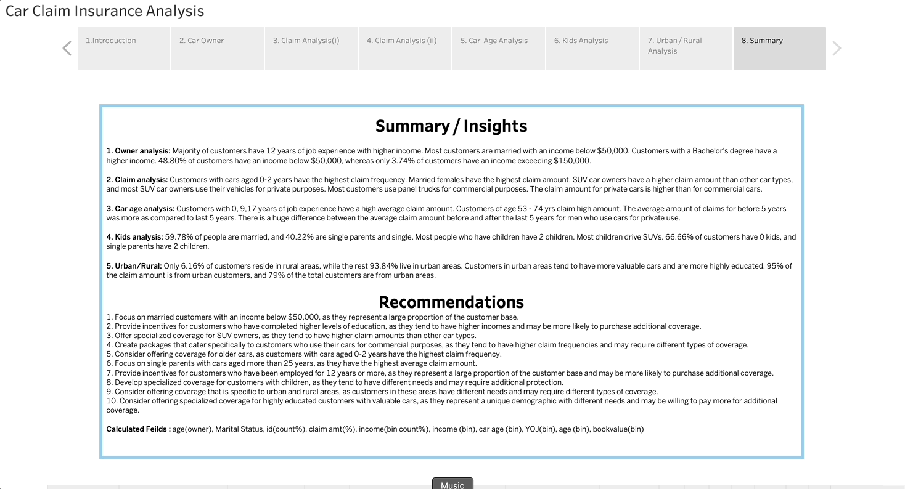

# Car Claim Analysis Project

## Introduction

This project aims to dissect the various factors affecting car insurance premiums. Insights gleaned will enable senior managers at insurance companies to make informed decisions in policy development and risk assessment.

## Project Details

- **Title**: Car Claim Analysis
- **Objective**: To analyze factors that influence car insurance premiums.
- **Stakeholders**: Senior Managers of Insurance Companies.

## Strategic Recommendations

Based on our analysis, we recommend the following strategies for targeting specific customer segments:

1. **Marital & Income-Based Targeting**: Focus on married customers with an income below $50,000.
2. **Educational Incentives**: Offer incentives to highly educated customers, correlating to potential for higher coverage purchase.
3. **Specialized SUV Coverage**: Develop specific packages for SUV owners due to higher claim amounts.
4. **Commercial Usage Packages**: Create tailored coverage for customers using cars for commercial purposes.
5. **Older Car Coverage**: Offer policies for older cars, noting higher claim frequency in cars aged 0-2 years.
6. **Single Parent Focus**: Address the needs of single parents with cars over 25 years old, who have high average claim amounts.
7. **Long-term Employment Incentives**: Target customers with 12+ years of employment for loyalty and additional coverage plans.
8. **Family-Oriented Coverage**: Develop coverage that caters to customers with children.
9. **Location-Specific Coverage**: Tailor coverage based on the unique needs of urban and rural residents.
10. **High-Value Customer Coverage**: Offer specialized plans for highly educated customers with valuable cars.

## Tableau Visualization

### Car Owner Analysis

### Claim Analysis - Part 1

### Claim Analysis - Part 2

### Claim Age Analysis

### Kids Analysis

### Urban and Rural Analysis

### Summary of Findings

To view detailed visualizations of the analysis, please visit the Tableau Public link below:
[Car Claim Analysis Visualization on Tableau Public](https://public.tableau.com/app/profile/sai.kiran7316/viz/saikiran/Analysis?publish=yes)
